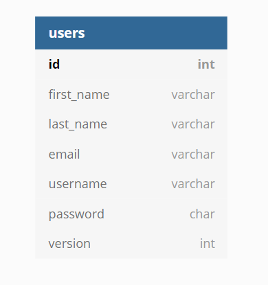

## Back end for E-commerce project

#### General

This is a back end for the rather trite e-commerce website. 
Initially developed during compulsory internship at my university, 
this project undergone a number of revisions.
Current revision is the last, and it introduces the following changes:
 - Complete mechanism of JWT authentication and authorization
 - Support of hypertext in the API
 - DTOs
 - Service and repository layers overhaul
 - New mechanism of exception handling that is (arguably) better 
 
 
Front end can be found [here](https://github.com/Leenocktopus/ecommerce-project-webapp).

Technologies used: *Spring Boot, Spring Data, JPA/Hibernate, MySQL, Spring Security, JJWT, Spring HATEOAS, Maven, Lombok.*

#### Data model
The domain knowledge was decomposed into a number of tables, thus providing
efficient storage for all necessary data and precluding possible anomalies.
The entity-relationship model is shown down below: 

#### Resources
Resources and their uniform locators were developed with best practices in mind
and can be reviewed in the following table:

|resource|URL|
|---|---|
|categories|/categories|
|single category|/categories/{categoryId}|
|manufacturers|/manufacturers|
|single manufacturer|/categories/{manufacturerId}|
|products|/products|
|single product|/products/{productId}|
|product attributes|/produts/{productId}/attributes|
|single product attribute|/produts/{productId}/attributes/{attributeId}|
|products comments|/products/{productId}/comments|
|single products comment|/products/{productId}/comments/{commentId}|
|orders|/orders|
|single order|/orders/{orderId}|

***Note:** since all URLs have "/api/v1" prefix, it wasn't included in the table*

#### JWT Authentication&Authorization
Since the final product should feature admin functionality as well as functionality for 
regular users, there is a need for elaborate authentication and authorization mechanism.  
The full mechanism of authentication is derived from [Ben Awad's](https://www.youtube.com/watch?v=iD49_NIQ-R4&t=364s) 
approach to provide efficient authentication and stave off any unwanted XSS or CSRF attacks. 

Specifically for the purpose of security mechanism, there is an additional database
which holds user data and consists of 1 table:
 

#### Hypertext support
Hypertext, to my knowledge is far from being widely used in today's APIs.
Nevertheless, seeing that it would only benefit the final product, I decided to add link relations between resources. 
The end product is akin to a file system with the [MainController](https://github.com/Leenocktopus/ecommerce-project-API/blob/master/src/main/java/com/leandoer/controller/MainController.java).
acting as it's root.
I was content with the result, but I did end up not using links for the most part in the front end. 
Nonetheless, Some of the benefits of hypertext like pagination links are not in the least useless.
